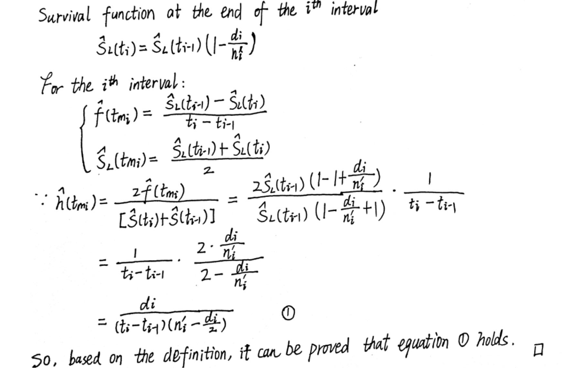

```{r setup, echo = FALSE, cache = FALSE, message = FALSE}
rm(list = ls())
library(knitr)
## Global options
opts_chunk$set(echo      = TRUE,
	             cache     = TRUE,
               prompt    = FALSE,
               tidy      = FALSE,
               comment   = NA,
               message   = FALSE,
               warning   = FALSE,
               dpi       = 150,
               fig.width = 4, 
               fig.asp   = 5/7,
               fig.align = "center")
# attr.source = '.numberLines'
```
# Problem 1

In the solution, I use the functions from the user's guide of SAS so that the survival function will be different from the theoretical function in PPT. For other functions, I will further explain in detail.

#### Part 1

|Interval	|Time Period	|Events	|Censor|	At risk at the beginning of the interval	|Average number at risk in the interval|
|---|---|---|---|---|---|
|1	|[0,4)	|2	|1	|20	|19.5|
|2	|[4,8)	|1	|1	|17	|16.5|
|3	|[8,12)	|0	|3	|15	|13.5|
|4	|[12,16)	|1	|2 	|12	|11|

The life-table estimates are computed by counting the numbers of censored and uncensored observations that fall into each of the time intervals $[t_{i-1},t_i),i=1,2,...,k+1$, where $t_0=0$ and $t_{k+1} = \infty$. Let $n_i$  be the number of units entering the interval $[t_{i-1},t_i)$, and let $d_i$ be the number of events occurring in the interval. Let $b_i = t_i - t_{i-1}$, and let $n_i^{'} = n_i - w_i/2$, where $w_i$ is the number of units censored in the interval. The **effective sample size** of the interval $[t_{i-1},t_i)$ is denoted by $n_i^{'}$. Let $t_{mi}$  denote the midpoint of $[t_{i-1},t_i)$.

#### Part 2

The conditional probability is an event in $[t_{i-1},t_i)$ is estimated by
$$\hat{q_i} = \frac{d_i}{n_i^{'}}$$

and its estimated standard error is

|Interval|	Time Period	|Survival probability	|PDF|
|---|---|---|---|
|1	|[0,4)	|1|	0.025641|
|2	|[4,8)|	0.897436	|0.013598|
|3	|[8,12)|	0.843046	|0|
|4	|[12,16)|	0.843046	|0.01916|


|Interval	|Time Period	|Hazard|	se(S(t))|
|---|---|---|---|
|1|	[0,4)|	0.027027|	0|
|2	|[4,8)|	0.015625|	0.0687|
|3|	[8,12)	|0|	0.0833|
|4|[12,16)|	0.02381	|0.0833|


The conditional probability of an event in  is estimated by
$$\hat{q_i} = \frac{d_i}{n_i^{'}}$$

 		 	 
and its estimated standard error is

$$\hat{\sigma}(\hat{q_i}) = \sqrt{\frac{\hat{q_i}\hat{p_i}}{n_i^{‘}}}$$
 		 	 
where $\hat{p_i}=1-\hat{q_i}$.

The estimate of the survival function at $t_i$ is

$$ \hat{S}(t_i)=\left\{
\begin{matrix}
     1    &  i=0\\
  \hat{S}(t_{i-1})p_{i-1} & i >0
\end{matrix}
\right.
$$
 		
 	 
and its estimated standard error is

$$\hat{\sigma}(\hat{S}(t_i)) = \hat{S}(t_i)\sqrt{\Sigma_{j=1}^{i-1}\frac{\hat{q_j}}{n_j^{‘}\hat{p_j}}}$$
 		 	 
The density function at $t_{mi}$ is estimated by

$$\hat{f}(t_{mi}) = \frac{ \hat{S}(t_{i-1})\hat{q_{i-1}}}{b_i}$$

The estimated hazard function at $t_{mi}$ is

$$\hat{h}(t_{mi}) = \frac{2\hat{q_i}}{b_i(1+\hat{p_i})}$$


# Problem 2




# Problem 3

## Load packages

```{r , load_packages, message = FALSE,warning=FALSE}
library(survival)
library(tidyverse)
library(ggfortify)
library(dplyr)
library(ggplot2)
library(biostat3)
library(knitr)
```


## Ovarian Cancer:

* futime: survival or censoring time(day)
* fustat: censoring status(censor = 0)
* age: in years
* resid.ds: residual disease present(1=no, 2=yes)
* rx: treatment group
* ecog.ps: ECOG performance status(1 is better)

```{r ovarian, message=FALSE, warning=FALSE}
data("ovarian")
attach(ovarian)
```


## Life-table summary stratified by rx
```{r}
res <- summary( survfit( Surv(futime, fustat)~rx, data=ovarian))
cols <- lapply(c(2:6, 8:11) , function(x) res[x])
tbl <- do.call(data.frame, cols)
tbl
```


## Create life-table stratified by rx

```{r}
ovarian_rx1 <- ovarian |>
  filter(rx == 1) |>
  arrange(futime)

ovarian_rx2<- ovarian |>
  filter(rx == 2)|>
  arrange(futime)

lifet1<-lifetab2(Surv(futime, fustat == 1)~1,ovarian_rx1)
lifet2<-lifetab2(Surv(futime, fustat == 1)~1,ovarian_rx2)
print(lifet1, digits = 2)
print(lifet2, digits = 2)
```


## Plot hazard function by rx based on life-table estimate

```{r}
hazard1<-lifet1 |>
  dplyr::select(tstart, tstop, hazard) |>
  mutate(tmedian = (tstart+tstop)/2, rx ="1")

hazard2<-lifet2 |>
  dplyr::select(tstart, tstop, hazard) |>
  mutate(tmedian = (tstart+tstop)/2, rx ="2")

hazard <- rbind(hazard1,hazard2)
```

```{r}
ggplot(hazard, aes(x = tmedian, y = hazard, color = rx)) +
  geom_point()+
  geom_line()


```


## Plot K-M survival function by rx

```{r}
ovarian.survfit <-
  survfit(Surv(futime, fustat)~rx,data= ovarian)

ovarian.survfit |>
  autoplot() +
  ylab("S(t)") +
  xlab("Time")
```

## Median survival time for each treatment group

For the group 1(rx = 1), the median survival time is $534.5(\frac{431+638}{2})$ days.
For the group 2(rx = 2), the median survival time is not sure, because over half of patients are still censored.

## Compare survival function estimations between K-M and F-H methods


#### Nelson-Aalen(Fleming-Harrington) and K-M estimators

* Survival function:

$$ \hat{S_F}(t)=\left\{
\begin{matrix}
     1    &  t<t_1\\
  \prod_{t_i \le t}exp[-\frac{d_i}{n_i}] & t \ge t_1
\end{matrix}
\right.
$$

$$ \hat{S_K}(t)=\left\{
\begin{matrix}
     1    &  t<t_1\\
  \prod_{t_i \le t}[1-\frac{d_i}{n_i}] & t \ge t_1
\end{matrix}
\right.
$$

$$\because exp[-\frac{d_i}{n_i}] \ge1-\frac{d_i}{n_i}$$

So, Fleming-Harrington estimator can always be larger than K-M estimator.

## Describe the analyses and write conclusions

From the survival functions, patients in treatment group 2(rx=2) generally perform better than those in group 1(rx=1). Besides, the median survival time has suggested the same results, but nothing could be referred from the hazard plots. Last but not least, after comparing ECOG performance status in different groups, censored ones in group 2 generally perform better than in group 1.


# References

Edmonson JH, Fleming TR, Decker DG, Malkasian GD, Jorgensen EO, Jefferies JA, Webb MJ, Kvols LK. Different chemotherapeutic sensitivities and host factors affecting prognosis in advanced ovarian carcinoma versus minimal residual disease. Cancer Treat Rep. 1979 Feb;63(2):241-7. PMID: 445503.

