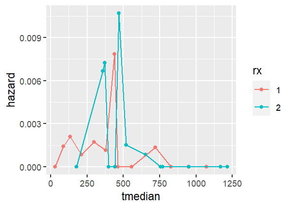
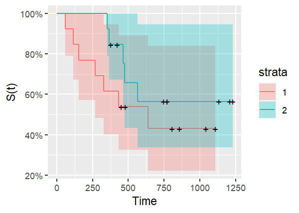

Life_Table
================
Zhuodiao Kuang
2023-09-29

# Load packages

``` r
library(survival)
library(tidyverse)
library(ggfortify)
library(dplyr)
library(ggplot2)
library(biostat3)
library(knitr)
```

# Ovarian Cancer:

- futime: survival or censoring time(day)
- fustat: censoring status(censor = 0)
- age: in years
- resid.ds: residual disease present(1=no, 2=yes)
- rx: treatment group
- ecog.ps: ECOG performance status(1 is better)

``` r
data("ovarian")
attach(ovarian)
```

# Life-table summary stratified by rx

``` r
res <- summary( survfit( Surv(futime, fustat)~rx, data=ovarian))
cols <- lapply(c(2:6, 8:11) , function(x) res[x])
tbl <- do.call(data.frame, cols)
tbl
```

       time n.risk n.event n.censor      surv     cumhaz   std.chaz strata  type
    1    59     13       1        0 0.9230769 0.07692308 0.07692308   rx=1 right
    2   115     12       1        0 0.8461538 0.16025641 0.11340901   rx=1 right
    3   156     11       1        0 0.7692308 0.25116550 0.14534809   rx=1 right
    4   268     10       1        0 0.6923077 0.35116550 0.17642581   rx=1 right
    5   329      9       1        0 0.6153846 0.46227661 0.20849879   rx=1 right
    6   431      8       1        0 0.5384615 0.58727661 0.24309822   rx=1 right
    7   638      5       1        2 0.4307692 0.78727661 0.31479636   rx=1 right
    8   353     13       1        0 0.9230769 0.07692308 0.07692308   rx=2 right
    9   365     12       1        0 0.8461538 0.16025641 0.11340901   rx=2 right
    10  464      9       1        2 0.7521368 0.27136752 0.15876802   rx=2 right
    11  475      8       1        0 0.6581197 0.39636752 0.20207000   rx=2 right
    12  563      7       1        0 0.5641026 0.53922466 0.24746807   rx=2 right

# Create life-table stratified by rx

``` r
ovarian_rx1 <- ovarian |>
  filter(rx == 1) |>
  arrange(futime)

ovarian_rx2<- ovarian |>
  filter(rx == 2)|>
  arrange(futime)

lifet1<-lifetab2(Surv(futime, fustat == 1)~1,ovarian_rx1)
lifet2<-lifetab2(Surv(futime, fustat == 1)~1,ovarian_rx2)
print(lifet1, digits = 2)
```

              tstart tstop nsubs nlost nrisk nevent surv     pdf  hazard se.surv
    0-59           0    59    13     0  13.0      0 1.00 0.00000 0.00000   0.000
    59-115        59   115    13     0  13.0      1 1.00 0.00137 0.00143   0.000
    115-156      115   156    12     0  12.0      1 0.92 0.00188 0.00212   0.074
    156-268      156   268    11     0  11.0      1 0.85 0.00069 0.00085   0.100
    268-329      268   329    10     0  10.0      1 0.77 0.00126 0.00173   0.117
    329-431      329   431     9     0   9.0      1 0.69 0.00075 0.00115   0.128
    431-448      431   448     8     0   8.0      1 0.62 0.00452 0.00784   0.135
    448-477      448   477     7     1   6.5      0 0.54 0.00000 0.00000   0.138
    477-638      477   638     6     1   5.5      0 0.54 0.00000 0.00000   0.138
    638-803      638   803     5     0   5.0      1 0.54 0.00065 0.00135   0.138
    803-855      803   855     4     1   3.5      0 0.43 0.00000 0.00000   0.147
    855-1040     855  1040     3     1   2.5      0 0.43 0.00000 0.00000   0.147
    1040-1106   1040  1106     2     1   1.5      0 0.43 0.00000 0.00000   0.147
    1106-Inf    1106   Inf     1     1   0.5      0 0.43      NA      NA   0.147
               se.pdf se.hazard
    0-59          NaN       NaN
    59-115    0.00132   0.00143
    115-156   0.00180   0.00212
    156-268   0.00066   0.00085
    268-329   0.00121   0.00172
    329-431   0.00072   0.00115
    431-448   0.00435   0.00783
    448-477       NaN       NaN
    477-638       NaN       NaN
    638-803   0.00061   0.00134
    803-855       NaN       NaN
    855-1040      NaN       NaN
    1040-1106     NaN       NaN
    1106-Inf       NA        NA

``` r
print(lifet2, digits = 2)
```

              tstart tstop nsubs nlost nrisk nevent surv     pdf  hazard se.surv
    0-353          0   353    13     0  13.0      0 1.00 0.00000 0.00000   0.000
    353-365      353   365    13     0  13.0      1 1.00 0.00641 0.00667   0.000
    365-377      365   377    12     0  12.0      1 0.92 0.00641 0.00725   0.074
    377-421      377   421    11     1  10.5      0 0.85 0.00000 0.00000   0.100
    421-464      421   464    10     1   9.5      0 0.85 0.00000 0.00000   0.100
    464-475      464   475     9     0   9.0      1 0.85 0.00855 0.01070   0.100
    475-563      475   563     8     0   8.0      1 0.75 0.00107 0.00152   0.126
    563-744      563   744     7     0   7.0      1 0.66 0.00052 0.00085   0.141
    744-769      744   769     6     1   5.5      0 0.56 0.00000 0.00000   0.149
    769-770      769   770     5     1   4.5      0 0.56 0.00000 0.00000   0.149
    770-1129     770  1129     4     1   3.5      0 0.56 0.00000 0.00000   0.149
    1129-1206   1129  1206     3     1   2.5      0 0.56 0.00000 0.00000   0.149
    1206-1227   1206  1227     2     1   1.5      0 0.56 0.00000 0.00000   0.149
    1227-Inf    1227   Inf     1     1   0.5      0 0.56      NA      NA   0.149
               se.pdf se.hazard
    0-353         NaN       NaN
    353-365   0.00616   0.00666
    365-377   0.00616   0.00724
    377-421       NaN       NaN
    421-464       NaN       NaN
    464-475   0.00812   0.01068
    475-563   0.00102   0.00151
    563-744   0.00049   0.00085
    744-769       NaN       NaN
    769-770       NaN       NaN
    770-1129      NaN       NaN
    1129-1206     NaN       NaN
    1206-1227     NaN       NaN
    1227-Inf       NA        NA

# Plot hazard function by rx based on life-table estimate

``` r
hazard1<-lifet1 |>
  dplyr::select(tstart, tstop, hazard) |>
  mutate(tmedian = (tstart+tstop)/2, rx ="1")

hazard2<-lifet2 |>
  dplyr::select(tstart, tstop, hazard) |>
  mutate(tmedian = (tstart+tstop)/2, rx ="2")

hazard <- rbind(hazard1,hazard2)
```

``` r
ggplot(hazard, aes(x = tmedian, y = hazard, color = rx)) +
  geom_point()+
  geom_line()
```



# Plot K-M survival function by rx

``` r
ovarian.survfit <-
  survfit(Surv(futime, fustat)~rx,data= ovarian)

ovarian.survfit |>
  autoplot() +
  ylab("S(t)") +
  xlab("Time")
```



# Median survival time for each treatment group

For the group 1(rx = 1), the median survival time is
$534.5(\frac{431+638}{2})$ days. For the group 2(rx = 2), the median
survival time is not sure, because over half of patients are still
censored.

# Compare survival function estimations between K-M and F-H methods

#### Nelson-Aalen(Fleming-Harrington) and K-M estimators

- Survival function:

$$\begin{equation}
\chi_{\mathbb{Q}}(x)=
    \begin{cases}
        1 & \text{if } x \in \mathbb{Q}\\
        0 & \text{if } x \in \mathbb{R}\setminus\mathbb{Q}
    \end{cases}
\end{equation}$$

# Descrbe the analyses and write conclusions

# References

Edmonson JH, Fleming TR, Decker DG, Malkasian GD, Jorgensen EO,
Jefferies JA, Webb MJ, Kvols LK. Different chemotherapeutic
sensitivities and host factors affecting prognosis in advanced ovarian
carcinoma versus minimal residual disease. Cancer Treat Rep. 1979
Feb;63(2):241-7. PMID: 445503.
